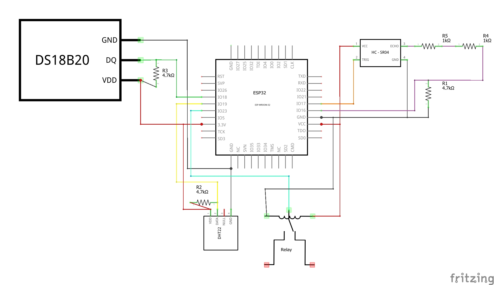

# 💧 Water Tank Monitor with ESP32

An all-in-one ESP32-based water tank monitoring system that measures:

- Water level using an ultrasonic sensor (AJ-SR04M / HC-SR04)
- Water temperature using DS18B20
- Outside temperature and humidity using a DHT22
- Pump/relay control via web interface or MQTT
- MQTT integration with configurable topic publishing
- Web UI with AJAX updates and settings
- WiFiManager for first-time WiFi configuration

---

## 📦 Features

- 🌀 Real-time water level calculation in cm and %
- 🌡️ Dual temperature sensing: water & ambient
- 📊 Volume estimation based on tank shape (rectangular or cylindrical)
- ⚙️ Web interface for configuration, calibration, and manual control
- 🛰️ MQTT support with configurable topics (sensor data + relay state)
- 📱 Works with Home Assistant or any MQTT broker
- 🔧 EEPROM storage of all settings (WiFi, MQTT, tank, interval, etc.)
- 🔌 Relay control from web or MQTT (`/relay_cmd`)

---

## 🧰 Hardware Required

| Component                  | Example GPIO | Notes                             |
|---------------------------|--------------|-----------------------------------|
| ESP32 WROOM-32            | -            | Main microcontroller              |
| Ultrasonic Sensor (AJ-SR04M / HC-SR04) | TRIG: GPIO17 / ECHO: GPIO18 | With voltage divider on ECHO |
| DS18B20 Temperature Sensor| GPIO21       | Requires 4.7kΩ pull-up to 3.3V    |
| DHT22 Temp/Humidity Sensor| GPIO19       | Requires 4.7kΩ pull-up to 3.3V    |
| Relay Module (SRD-05VDC-SL-C) | GPIO23 | 5V-controlled                     |
| Resistors                 | -            | 2×1kΩ + 1×4.7kΩ (voltage divider) |

> ✅ Use a voltage divider (2×1kΩ + 4.7kΩ) on the ultrasonic sensor's ECHO pin to protect ESP32 GPIO from 5V logic levels.

---

## 🔌 Wiring Diagram

See Wiring Diagram :

 

or Fritzing file for full details.

You can also reference this simplified table:

| Module       | VCC  | GND | ESP32 GPIO    | Resistors Needed          |
| ------------ | ---- | --- | ------------- | ------------------------- |
| AJ-SR04M     | 5V   | GND | TRIG → GPIO17 | None                      |
| AJ-SR04M     |      |     | ECHO → GPIO18 | 2×1kΩ + 1×4.7kΩ (divider) |
| DS18B20      | 3.3V | GND | DATA → GPIO21 | 1×4.7kΩ (pull-up to 3.3V) |
| DHT22        | 3.3V | GND | DATA → GPIO19 | 1×4.7kΩ (pull-up to 3.3V) |
| Relay Module | 5V   | GND | IN → GPIO23   | None                      |

---

## 🌐 Web Interface

Accessible via browser at the ESP32 IP address.  
Features:

- Live dashboard with temperature, level, volume, % fill
- Manual relay control
- Tank configuration (shape, size)
- MQTT settings
- Update read/publish intervals
- Factory reset button

---

## ☁️ MQTT Topics

All topics are prefixed with your configured tank name (e.g. `cuve_1`).

| Topic              | Description               |
|-------------------|---------------------------|
| `<prefix>/water_distance` | Distance from sensor to surface |
| `<prefix>/water_height`   | Height of water in cm            |
| `<prefix>/water_percent`  | Percentage fill                  |
| `<prefix>/water_volume`   | Estimated volume in liters       |
| `<prefix>/water_temp`     | Water temperature (DS18B20)      |
| `<prefix>/outside_temp`   | Air temperature (DHT22)          |
| `<prefix>/outside_humi`   | Humidity (DHT22)                 |
| `<prefix>/relay_state`    | ON/OFF state of the relay        |

> To control the relay remotely:  
> Publish `"on"` or `"off"` to `<prefix>/relay_cmd`

---

## ⚙️ Settings

Stored in EEPROM via the `Preferences` API:

- Tank name
- Tank shape and dimensions
- Max water height (calibration)
- MQTT credentials and interval
- Read interval for sensors
- Enabled MQTT topics

---

## 🔧 Getting Started

1. Flash the firmware via Arduino IDE or PlatformIO
2. Connect to the WiFi AP `Tank_Automation_Config`
3. Go to `http://192.168.4.1` and enter your WiFi credentials
4. The ESP32 will reboot and be accessible on your LAN
5. Access the dashboard and configure your tank and MQTT

---

## 🚀 To Do / Ideas

- Support multiple tanks via web tabs
- OTA firmware updates
- Home Assistant full integration

---

## 🧑‍💻 Author

Benjamin Maas — [@GitHub](https://github.com/yourusername)  
Feel free to fork, use, and improve!

---

## Licence

Ce projet est sous licence **CC BY-NC 4.0** — utilisation commerciale interdite.  
Détails : [LICENSE](./LICENSE)

